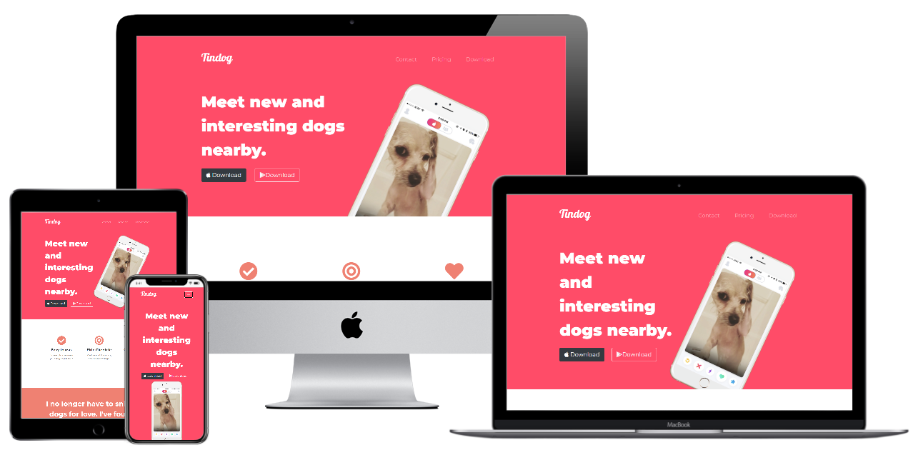

# Tindog

This is a simple dog dating website. It was made as part of the online web development course in Udemy. 

## Live Link

You can see the live demo of the website here:

[(https://cjlacaste28.github.io/Tindog/)](https://cjlacaste28.github.io/Tindog/)

# 

## Technologies

-   HTML
-   CSS
-   Bootstrap
 
## Lessons Covered Throughout Development 

- Wireframing 
- Bootstrap Grid Layout 
- Bootstrap Containers
- Bootstrap Buttons 
- Bootstrap Carousel 
- Bootstrap Cards 
- Advanced CSS Manipulations 
- CSS Z-Index 
- Selector Priority
- Selector Combinations
 
## Resources Used 

- Angela Yu Web Development Bootcamp 
- Font Awesome 
- Udemy
 
## Author
 
- [Christian Lacaste](https://christianlacaste.me/)
